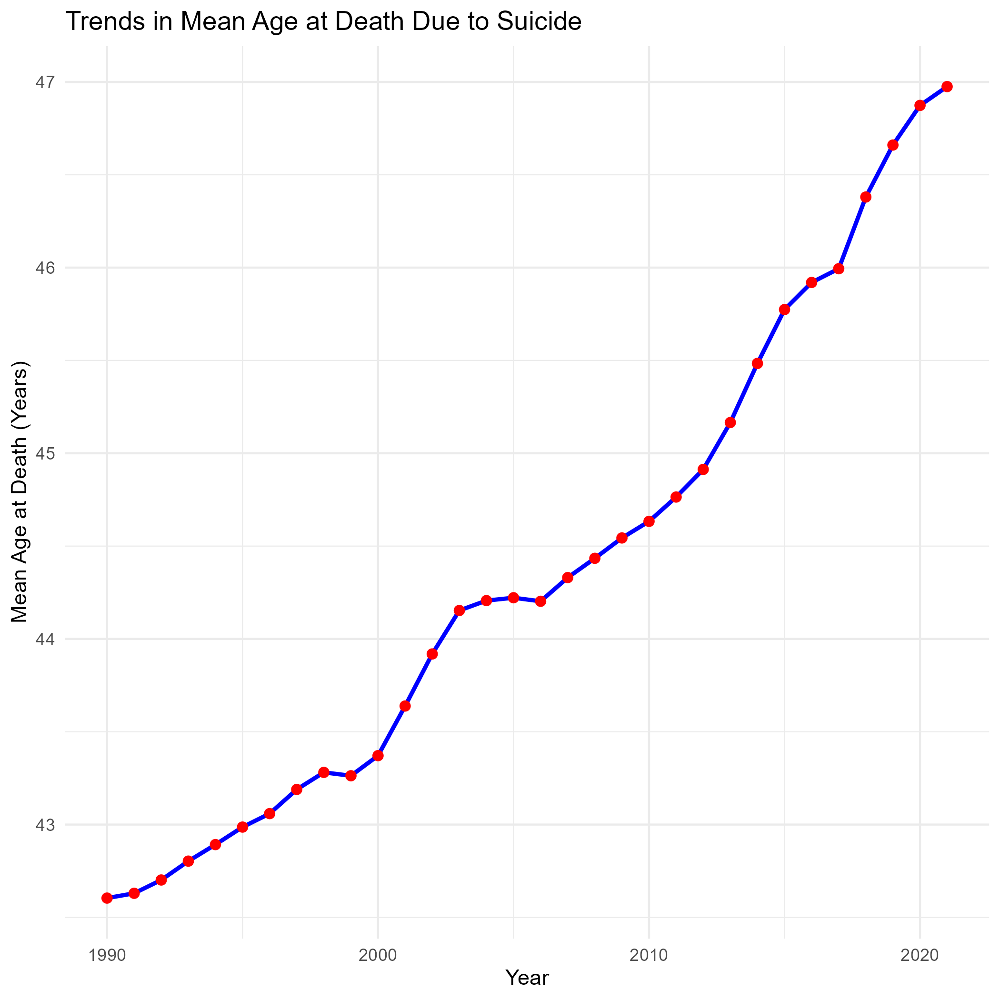

## Introduction 

This document analyzes the dataset "Mean age at death", provided by the Institute for Health Metrics and Evaluation (IHME) (https://www.healthdata.org). This dataset contains information on the mean age at death due to suicide from 1990 to 2021. The objective of this analysis is to understand the trends and patterns in the mean age at death over the years and to identify any significant changes or observations.

```{r, setup, echo = FALSE}
library(knitr)
opts_chunk$set(
  echo = FALSE, warning = FALSE, message = FALSE
)

data <- readRDS("output/data_clean.rds")
```
## Analysis 
### Mean Age at Death Over the Years 

The following table shows the mean age at death due to suicide in the global for each year:

```{r, table}
mean_age_table <- readRDS("output/mean_age_table.rds")
kable(mean_age_table, col.names = c("Year", "Mean Age at Death"), caption = "Mean Age at Death Due to Suicide Over the Years")
```

### Trends in Mean Age at Death 

The figure below illustrates the trend in mean age at death due to suicide from 1990 to 2021:

```{r, plot-trend}

```

The plot shows the changes in the mean age at death due to suicide over the years. Mean age has consistently increased since 1990, with an increase of more than 4 years between 1990 and 2020